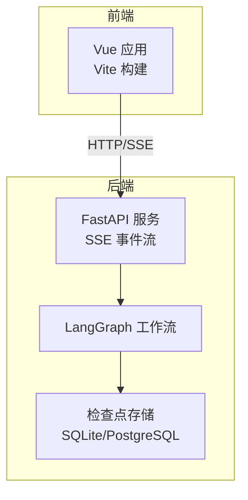
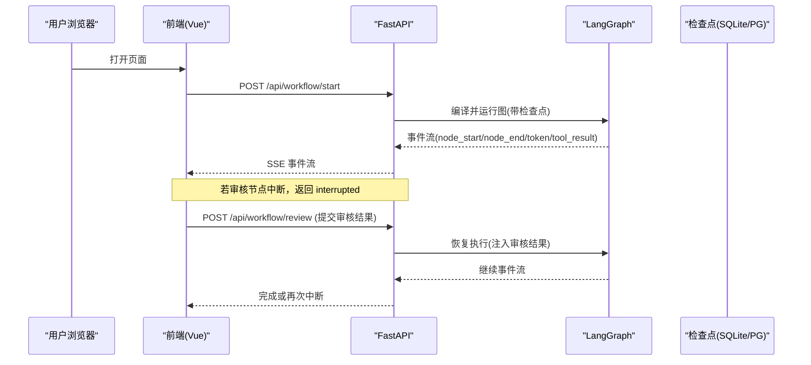
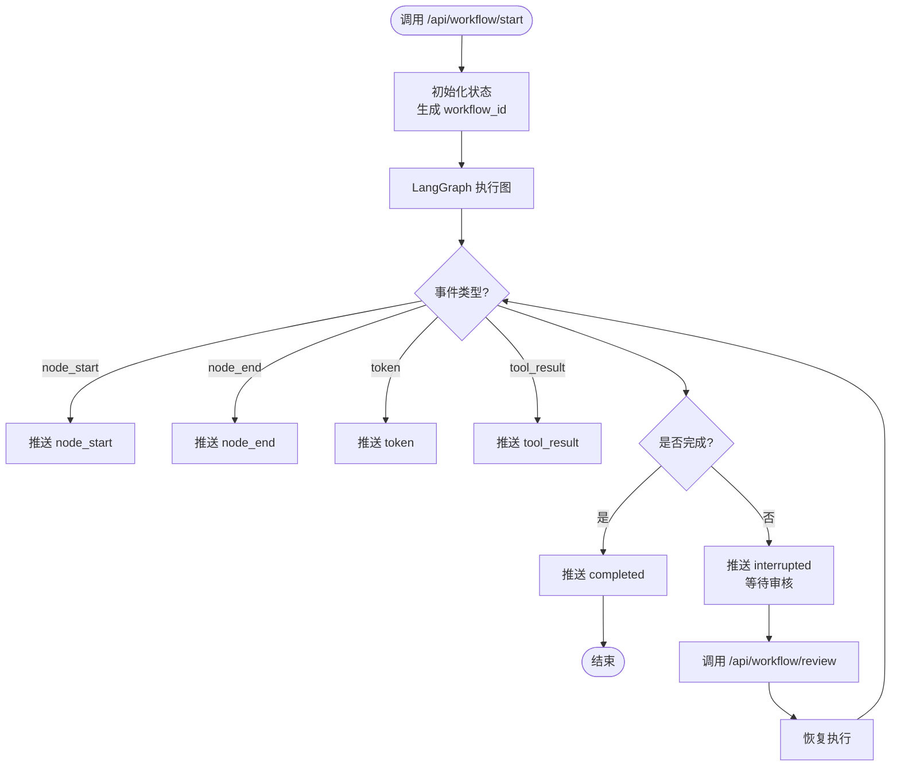
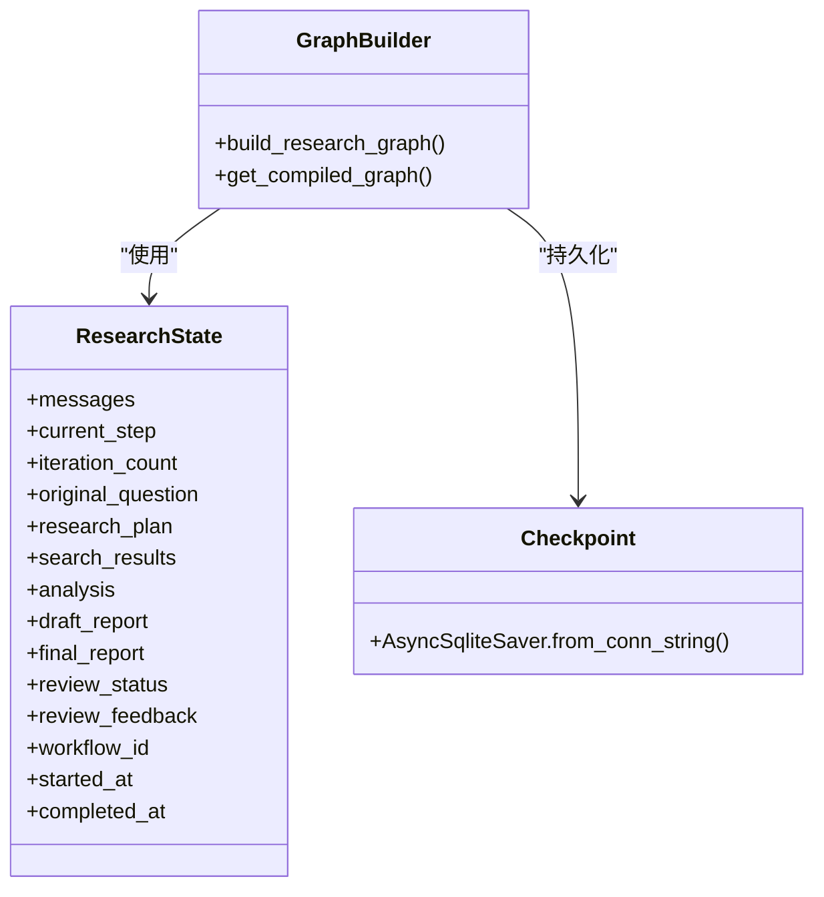
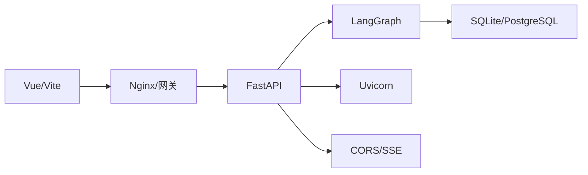

# 部署指南

<cite>
**本文引用的文件**
- [README.md](file://workflow-studio/README.md)
- [后端入口与API](file://workflow-studio/backend/app/main.py)
- [工作流图构建](file://workflow-studio/backend/app/graph.py)
- [配置与环境变量](file://workflow-studio/backend/app/config.py)
- [状态定义](file://workflow-studio/backend/app/state.py)
- [数据模型](file://workflow-studio/backend/app/schemas.py)
- [后端依赖](file://workflow-studio/backend/requirements.txt)
- [前端包管理](file://workflow-studio/frontend/package.json)
- [前端Vite配置](file://workflow-studio/frontend/vite.config.ts)
</cite>

## 目录
1. [简介](#简介)
2. [项目结构](#项目结构)
3. [核心组件](#核心组件)
4. [架构总览](#架构总览)
5. [详细组件分析](#详细组件分析)
6. [依赖分析](#依赖分析)
7. [性能考虑](#性能考虑)
8. [故障排查指南](#故障排查指南)
9. [结论](#结论)
10. [附录](#附录)

## 简介
本指南面向生产环境，提供 Workflow Studio 的完整部署说明。内容涵盖：容器化（Docker）策略、环境变量管理、数据库与检查点持久化、缓存与监控日志、不同环境的配置示例（开发/测试/生产）、常见问题与解决方案，确保部署过程可重复、可维护、可扩展。

## 项目结构
Workflow Studio 由前后端组成：
- 后端：FastAPI + LangGraph，提供工作流启动、人工审核、状态查询等接口，使用 SQLite 作为默认检查点存储。
- 前端：Vue 3 + Vite，通过代理将 /api 请求转发到后端，支持本地开发与生产静态资源托管。

图表来源
- [后端入口与API:14-21](file://workflow-studio/backend/app/main.py#L14-L21)
- [工作流图构建:65-77](file://workflow-studio/backend/app/graph.py#L65-L77)

章节来源
- [README.md:23-46](file://workflow-studio/README.md#L23-L46)
- [前端Vite配置:12-20](file://workflow-studio/frontend/vite.config.ts#L12-L20)

## 核心组件
- FastAPI 服务：提供工作流启动、人工审核、状态查询、图结构获取等 REST 接口；启用 CORS 中间件；返回 SSE 流式响应。
- LangGraph 工作流：定义节点与边，包含条件路由与中断机制（在审核前暂停），支持检查点恢复。
- 配置与环境变量：从 .env 加载 LLM 相关配置（密钥、基地址、模型名）。
- 状态与数据模型：定义工作流状态字段与请求体模型。

章节来源
- [后端入口与API:14-21](file://workflow-studio/backend/app/main.py#L14-L21)
- [工作流图构建:23-77](file://workflow-studio/backend/app/graph.py#L23-L77)
- [配置与环境变量:1-9](file://workflow-studio/backend/app/config.py#L1-L9)
- [状态定义:5-30](file://workflow-studio/backend/app/state.py#L5-L30)
- [数据模型:1-12](file://workflow-studio/backend/app/schemas.py#L1-L12)

## 架构总览
系统采用“前端静态资源 + 后端 API”的分层架构。前端通过 Vite 代理在开发阶段访问后端；生产环境通常由 Nginx 或云原生网关统一入口，反向代理至后端服务。工作流执行通过 LangGraph 驱动，事件以 SSE 推送给前端，状态通过检查点持久化，支持刷新后恢复。

图表来源
- [后端入口与API:34-103](file://workflow-studio/backend/app/main.py#L34-L103)
- [后端入口与API:106-154](file://workflow-studio/backend/app/main.py#L106-L154)
- [工作流图构建:65-77](file://workflow-studio/backend/app/graph.py#L65-L77)

## 详细组件分析

### 后端服务与API
- 启动工作流：创建初始状态，分配 workflow_id，使用 LangGraph 的事件流输出节点开始/结束、LLM token、工具结果；结束时判断是否被中断（等待审核）。
- 人工审核：接收审核结果，注入状态并恢复执行，继续事件流。
- 状态查询：根据 workflow_id 获取当前状态，用于页面刷新后恢复。
- 图结构：返回节点与边信息供前端渲染。

图表来源
- [后端入口与API:34-103](file://workflow-studio/backend/app/main.py#L34-L103)
- [后端入口与API:106-154](file://workflow-studio/backend/app/main.py#L106-L154)

章节来源
- [后端入口与API:34-103](file://workflow-studio/backend/app/main.py#L34-L103)
- [后端入口与API:106-154](file://workflow-studio/backend/app/main.py#L106-L154)
- [后端入口与API:157-200](file://workflow-studio/backend/app/main.py#L157-L200)

### 工作流图与检查点
- 节点与边：规划→搜索→分析→写作→审核→（通过则输出，不通过则修订再回到搜索），最多3轮修订后强制输出。
- 中断机制：在审核节点前中断，等待人工决策。
- 检查点：默认使用 SQLite 文件存储；生产建议切换为 PostgreSQL 以提升并发与可靠性。

图表来源
- [状态定义:5-30](file://workflow-studio/backend/app/state.py#L5-L30)
- [工作流图构建:23-77](file://workflow-studio/backend/app/graph.py#L23-L77)

章节来源
- [工作流图构建:23-77](file://workflow-studio/backend/app/graph.py#L23-L77)
- [状态定义:5-30](file://workflow-studio/backend/app/state.py#L5-L30)

### 配置与环境变量
- 环境变量：OPENAI_API_KEY、OPENAI_BASE_URL、LLM_MODEL，通过 python-dotenv 加载。
- 建议：在生产环境使用集中式密钥管理服务（如 KMS/Secrets Manager）注入环境变量，避免硬编码。

章节来源
- [配置与环境变量:1-9](file://workflow-studio/backend/app/config.py#L1-L9)

### 前端构建与代理
- 开发模式：Vite 提供热重载，端口 1993，并将 /api 请求代理到 http://localhost:1994。
- 生产模式：构建静态资源并通过 Web 服务器（Nginx/Caddy）托管，同时反向代理 /api 到后端服务。

章节来源
- [前端Vite配置:12-20](file://workflow-studio/frontend/vite.config.ts#L12-L20)
- [前端包管理:6-9](file://workflow-studio/frontend/package.json#L6-L9)

## 依赖分析
- 后端依赖：langgraph、langchain-core、langchain-openai、langgraph-checkpoint-sqlite、fastapi、uvicorn[standard]、sse-starlette、httpx、python-dotenv。
- 前端依赖：vue、@vue-flow/*、pinia、tailwindcss 等。

图表来源
- [后端依赖:1-10](file://workflow-studio/backend/requirements.txt#L1-L10)
- [前端包管理:11-29](file://workflow-studio/frontend/package.json#L11-L29)

章节来源
- [后端依赖:1-10](file://workflow-studio/backend/requirements.txt#L1-L10)
- [前端包管理:11-29](file://workflow-studio/frontend/package.json#L11-L29)

## 性能考虑
- 并发与进程数：使用 uvicorn 的 workers 数量匹配 CPU 核数，结合 GIL 特性进行调优。
- 检查点存储：生产环境建议使用 PostgreSQL 替代 SQLite，提升并发写入与可靠性。
- 网络与缓冲：SSE 响应已设置合适的头部以减少代理缓冲；生产建议在网关层关闭不必要的缓冲。
- 资源限制：为容器设置合理的 CPU/内存限制，避免 OOM。
- 前端优化：生产构建开启压缩与缓存策略，减少首屏时间。

[本节为通用指导，无需特定文件引用]

## 故障排查指南
- 无法连接 LLM：检查 OPENAI_API_KEY、OPENAI_BASE_URL 是否正确；确认网络可达。
- 工作流中断未恢复：确认 /api/workflow/review 调用携带正确的 workflow_id 与审核状态；检查状态查询接口是否返回 is_interrupted。
- 检查点丢失：确认 checkpoints.db 路径可写；生产迁移至 PostgreSQL 并验证连接字符串。
- 跨域问题：确认 CORS 允许的来源包含前端域名；生产环境更新 allow_origins。
- 前端代理失败：开发时确认 Vite proxy target 指向正确后端地址；生产确认 Nginx 反向代理配置。

章节来源
- [后端入口与API:157-173](file://workflow-studio/backend/app/main.py#L157-L173)
- [后端入口与API:14-21](file://workflow-studio/backend/app/main.py#L14-L21)
- [工作流图构建:65-77](file://workflow-studio/backend/app/graph.py#L65-L77)

## 结论
本指南提供了 Workflow Studio 的生产部署方案，涵盖容器化、环境变量、数据库与检查点、监控日志、性能优化及多环境配置示例。遵循本指南可实现稳定、可重复、可维护的部署流程。

[本节为总结性内容，无需特定文件引用]

## 附录

### 一、生产环境部署步骤（推荐）
- 准备基础镜像
  - Python 运行时（含 pip）
  - Node.js（仅用于前端构建）
  - 可选：PostgreSQL 客户端库
- 安装后端依赖
  - 进入 backend 目录，安装 requirements.txt 中的依赖
- 配置环境变量
  - 设置 OPENAI_API_KEY、OPENAI_BASE_URL、LLM_MODEL
  - 生产环境建议通过容器编排平台注入
- 启动后端服务
  - 使用 uvicorn 启动 app.main:app，绑定 0.0.0.0 并设置 workers
- 构建并托管前端
  - 进入 frontend 目录，执行构建命令
  - 将 dist 目录交由 Nginx 或云原生网关托管
- 配置反向代理
  - 将 /api 请求转发到后端服务
  - 配置静态资源缓存与压缩
- 配置检查点存储
  - 生产环境建议切换到 PostgreSQL，修改检查点连接串
- 健康检查与监控
  - 暴露健康检查端点（可在 FastAPI 中新增）
  - 接入日志收集与指标采集（如 Prometheus/Grafana）

章节来源
- [后端依赖:1-10](file://workflow-studio/backend/requirements.txt#L1-L10)
- [前端包管理:6-9](file://workflow-studio/frontend/package.json#L6-L9)
- [后端入口与API:14-21](file://workflow-studio/backend/app/main.py#L14-L21)
- [工作流图构建:65-77](file://workflow-studio/backend/app/graph.py#L65-L77)

### 二、Docker 容器化配置建议
- 多阶段构建
  - 第一阶段：Node.js 构建前端静态资源
  - 第二阶段：Python 运行后端服务
- 环境变量注入
  - 通过 docker run -e 或编排平台 Secret 注入敏感配置
- 数据卷挂载
  - 如需保留 SQLite 检查点，挂载持久卷（生产建议改用外部数据库）
- 资源限制与健康检查
  - 设置 CPU/内存限制
  - 实现健康检查端点以便编排平台探测

[本节为通用指导，无需特定文件引用]

### 三、环境变量管理
- 必需变量
  - OPENAI_API_KEY：LLM 访问密钥
  - OPENAI_BASE_URL：LLM 服务基地址
  - LLM_MODEL：使用的模型名称
- 建议实践
  - 使用 .env 文件进行本地开发
  - 生产环境通过容器编排平台注入，避免明文存储
  - 定期轮换密钥并记录审计日志

章节来源
- [配置与环境变量:1-9](file://workflow-studio/backend/app/config.py#L1-L9)

### 四、数据库与检查点策略
- 默认存储：SQLite（适合单机与低并发）
- 生产存储：PostgreSQL（高并发、高可用）
- 迁移步骤
  - 安装 PostgreSQL 并创建数据库
  - 修改检查点连接串指向 PG
  - 验证工作流中断与恢复功能

章节来源
- [工作流图构建:65-77](file://workflow-studio/backend/app/graph.py#L65-L77)

### 五、缓存策略
- 当前实现：无显式缓存层
- 建议
  - 对频繁读取的配置或元数据进行缓存（如 Redis）
  - 注意缓存失效与一致性策略

[本节为通用指导，无需特定文件引用]

### 六、监控与日志
- 日志
  - 使用结构化日志输出，便于聚合与分析
  - 记录关键事件（工作流开始/结束、中断、错误）
- 指标
  - 暴露 QPS、延迟、错误率等指标
  - 接入监控系统（Prometheus/Grafana）
- 告警
  - 针对错误率与延迟阈值设置告警规则

[本节为通用指导，无需特定文件引用]

### 七、不同部署场景配置示例
- 开发
  - 前端：npm run dev（端口 1993）
  - 后端：uvicorn app.main:app --reload --port 1994
  - 代理：Vite 将 /api 转发到 1994
- 测试
  - 前端：构建后由 Nginx 托管
  - 后端：固定 workers 数，启用日志级别 debug
  - 检查点：使用独立 SQLite 文件或测试 PG
- 生产
  - 前端：构建产物由 Nginx/网关托管，开启压缩与缓存
  - 后端：workers=CPU核数，启用 HTTPS，限制 CORS 来源
  - 检查点：使用 PostgreSQL，配置备份与恢复策略

章节来源
- [README.md:23-46](file://workflow-studio/README.md#L23-L46)
- [前端Vite配置:12-20](file://workflow-studio/frontend/vite.config.ts#L12-L20)
- [后端入口与API:14-21](file://workflow-studio/backend/app/main.py#L14-L21)

### 八、常见问题与解决方案
- 跨域报错
  - 调整 CORS 允许来源，生产环境限定域名
- SSE 连接中断
  - 检查网关是否缓冲或超时，禁用缓冲并延长超时
- 工作流状态不一致
  - 确认检查点存储可用且持久化成功
- 前端无法访问后端
  - 开发确认代理目标；生产确认反向代理配置

章节来源
- [后端入口与API:14-21](file://workflow-studio/backend/app/main.py#L14-L21)
- [后端入口与API:157-173](file://workflow-studio/backend/app/main.py#L157-L173)
- [工作流图构建:65-77](file://workflow-studio/backend/app/graph.py#L65-L77)