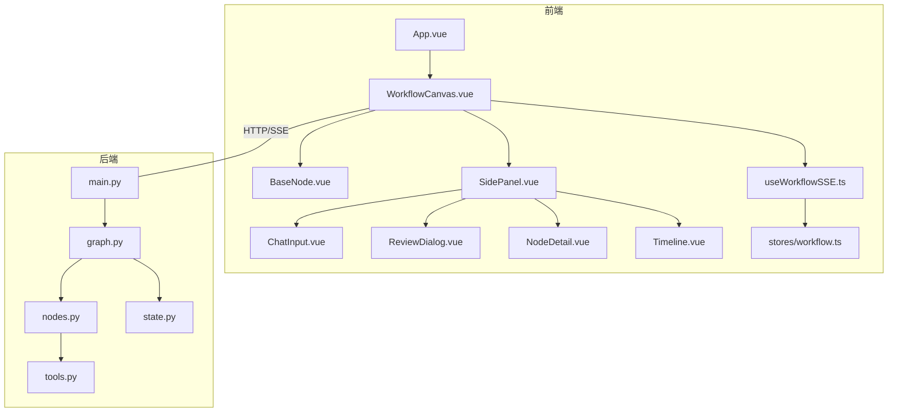
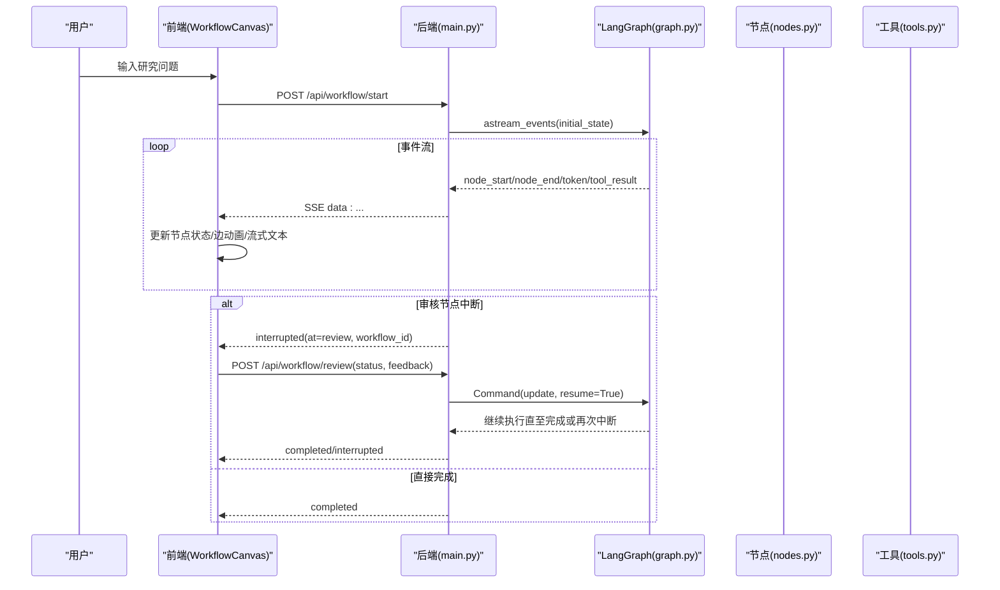
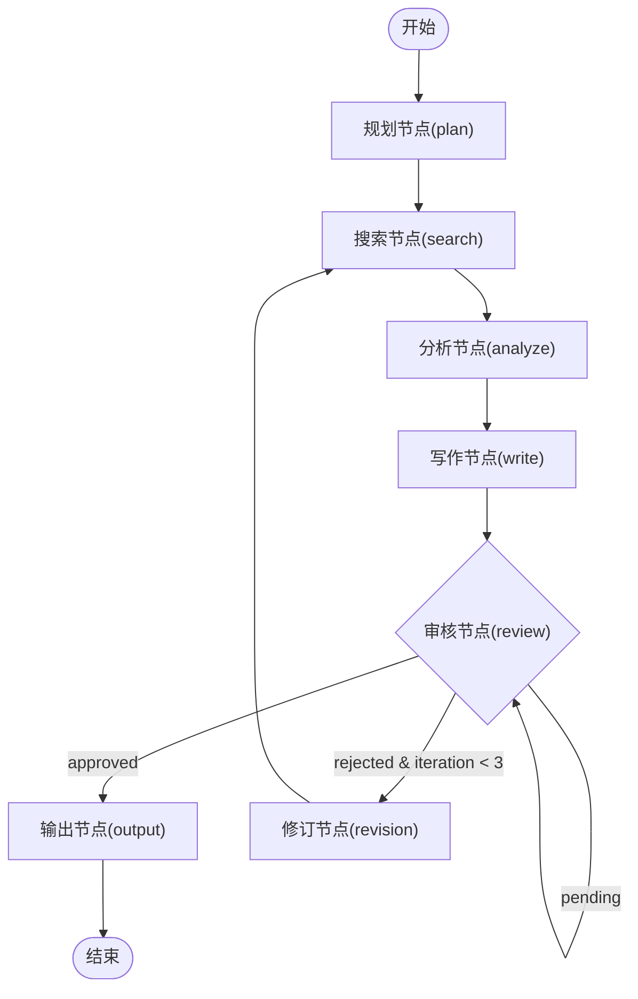
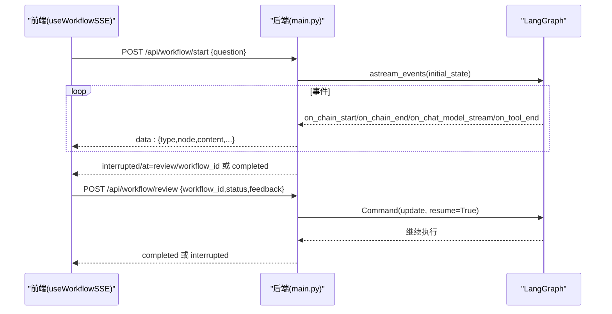
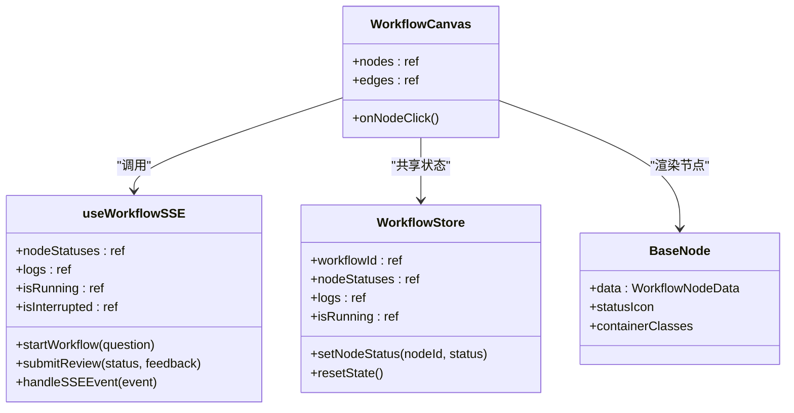
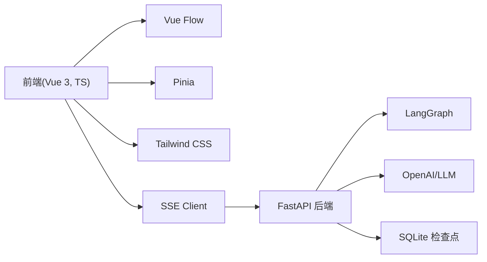

# 项目概述

<cite>
**本文引用的文件**
- [README.md](file://workflow-studio/README.md)
- [main.py](file://workflow-studio/backend/app/main.py)
- [graph.py](file://workflow-studio/backend/app/graph.py)
- [nodes.py](file://workflow-studio/backend/app/nodes.py)
- [state.py](file://workflow-studio/backend/app/state.py)
- [tools.py](file://workflow-studio/backend/app/tools.py)
- [WorkflowCanvas.vue](file://workflow-studio/frontend/src/components/WorkflowCanvas.vue)
- [useWorkflowSSE.ts](file://workflow-studio/frontend/src/composables/useWorkflowSSE.ts)
- [workflow.ts（Pinia Store）](file://workflow-studio/frontend/src/stores/workflow.ts)
- [BaseNode.vue](file://workflow-studio/frontend/src/components/nodes/BaseNode.vue)
- [SidePanel.vue](file://workflow-studio/frontend/src/components/layout/SidePanel.vue)
- [package.json](file://workflow-studio/frontend/package.json)
</cite>

## 目录
1. [简介](#简介)
2. [项目结构](#项目结构)
3. [核心组件](#核心组件)
4. [架构总览](#架构总览)
5. [详细组件分析](#详细组件分析)
6. [依赖关系分析](#依赖关系分析)
7. [性能考量](#性能考量)
8. [故障排查指南](#故障排查指南)
9. [结论](#结论)
10. [附录](#附录)

## 简介
本项目是一个基于 LangGraph + Vue 3 + Vue Flow 的可视化多 Agent 研究工作流系统，面向“研究助手”场景，提供从问题规划、搜索、分析、写作到人工审核与输出的完整闭环。系统通过 SSE（Server-Sent Events）将后端执行状态与 LLM 流式输出实时推送到前端，结合 Vue Flow 实现节点逐个亮起的可视化执行过程；同时支持在关键节点进行人工审核（Human-in-the-loop），并通过 SQLite 检查点持久化实现刷新恢复。

主要特性包括：
- 可视化工作流：Vue Flow 实时渲染执行状态，节点逐个亮起
- 多 Agent 协作：规划 → 搜索 → 分析 → 写作 → 审核 → 输出
- 条件分支：审核通过则输出，不通过则回到搜索循环
- 人工审核：在审核节点暂停等待人类判断
- 检查点恢复：SQLite 持久化，刷新页面不丢失进度
- SSE 实时推送：流式传输执行状态和 LLM 输出
- 防无限循环：最多 3 轮修订后强制输出

## 项目结构
项目采用前后端分离架构：
- 后端：FastAPI + LangGraph，负责工作流定义、节点执行、事件流与检查点管理
- 前端：Vue 3 + Vue Flow + Pinia，负责可视化画布、状态管理与交互

图表来源
- [WorkflowCanvas.vue:1-133](file://workflow-studio/frontend/src/components/WorkflowCanvas.vue#L1-L133)
- [useWorkflowSSE.ts:1-172](file://workflow-studio/frontend/src/composables/useWorkflowSSE.ts#L1-L172)
- [main.py:1-200](file://workflow-studio/backend/app/main.py#L1-L200)
- [graph.py:1-78](file://workflow-studio/backend/app/graph.py#L1-L78)
- [nodes.py:1-129](file://workflow-studio/backend/app/nodes.py#L1-L129)
- [state.py:1-30](file://workflow-studio/backend/app/state.py#L1-L30)
- [tools.py:1-26](file://workflow-studio/backend/app/tools.py#L1-L26)

章节来源
- [README.md:1-109](file://workflow-studio/README.md#L1-L109)
- [package.json:1-32](file://workflow-studio/frontend/package.json#L1-L32)

## 核心组件
- 后端工作流引擎
  - 图构建与编译：定义节点、边与条件路由，并在审核前中断
  - 事件流：将节点开始/结束、LLM token、工具结果等事件以 SSE 形式推送
  - 检查点：使用 AsyncSqliteSaver 持久化状态，支持中断恢复
- 前端可视化与交互
  - 画布：基于 Vue Flow 渲染节点与边，响应运行状态更新
  - 状态管理：composable 封装 SSE 事件处理，Pinia store 维护全局状态
  - 面板：输入、审核弹窗、节点详情、时间线日志

章节来源
- [graph.py:23-78](file://workflow-studio/backend/app/graph.py#L23-L78)
- [main.py:34-103](file://workflow-studio/backend/app/main.py#L34-L103)
- [WorkflowCanvas.vue:1-133](file://workflow-studio/frontend/src/components/WorkflowCanvas.vue#L1-L133)
- [useWorkflowSSE.ts:1-172](file://workflow-studio/frontend/src/composables/useWorkflowSSE.ts#L1-L172)
- [workflow.ts（Pinia Store）:1-75](file://workflow-studio/frontend/src/stores/workflow.ts#L1-L75)

## 架构总览
系统整体由“前端可视化层 + 后端工作流引擎”组成，通过 REST + SSE 通信。后端使用 LangGraph 定义有状态的多 Agent 工作流，包含线性流程与条件分支，并在审核节点中断等待人工决策。

图表来源
- [main.py:34-154](file://workflow-studio/backend/app/main.py#L34-L154)
- [graph.py:23-78](file://workflow-studio/backend/app/graph.py#L23-L78)
- [nodes.py:18-129](file://workflow-studio/backend/app/nodes.py#L18-L129)
- [useWorkflowSSE.ts:74-157](file://workflow-studio/frontend/src/composables/useWorkflowSSE.ts#L74-L157)

## 详细组件分析

### 后端工作流引擎（LangGraph）
- 图构建：定义 plan → search → analyze → write → review → (output | revision → search) 的流程，并在 review 前中断
- 条件路由：根据审核状态与迭代次数决定输出或修订，超过 3 轮强制输出
- 检查点：使用 SQLite 保存状态，支持刷新恢复与中断续跑

图表来源
- [graph.py:23-78](file://workflow-studio/backend/app/graph.py#L23-L78)
- [nodes.py:18-129](file://workflow-studio/backend/app/nodes.py#L18-L129)

章节来源
- [graph.py:11-78](file://workflow-studio/backend/app/graph.py#L11-L78)
- [nodes.py:18-129](file://workflow-studio/backend/app/nodes.py#L18-L129)
- [state.py:5-30](file://workflow-studio/backend/app/state.py#L5-L30)

### 事件流与 SSE（后端）
- 启动工作流：POST /api/workflow/start，返回事件流
- 提交审核：POST /api/workflow/review，注入审核结果并恢复执行
- 获取状态：GET /api/workflow/state/{workflow_id}，用于页面刷新恢复
- 获取图结构：GET /api/workflow/graph-structure，供前端渲染初始布局

图表来源
- [main.py:34-154](file://workflow-studio/backend/app/main.py#L34-L154)
- [useWorkflowSSE.ts:74-157](file://workflow-studio/frontend/src/composables/useWorkflowSSE.ts#L74-L157)

章节来源
- [main.py:34-200](file://workflow-studio/backend/app/main.py#L34-L200)

### 前端可视化与状态管理
- 画布：Vue Flow 渲染节点与边，监听 SSE 事件更新节点状态与边动画
- Composable：封装 SSE 连接、事件解析、状态更新与错误处理
- Store：Pinia 维护全局工作流状态（节点状态、日志、运行标志等）
- 面板：输入框触发工作流启动，审核弹窗提交审核结果，时间线展示执行日志

图表来源
- [WorkflowCanvas.vue:1-133](file://workflow-studio/frontend/src/components/WorkflowCanvas.vue#L1-L133)
- [useWorkflowSSE.ts:1-172](file://workflow-studio/frontend/src/composables/useWorkflowSSE.ts#L1-L172)
- [workflow.ts（Pinia Store）:1-75](file://workflow-studio/frontend/src/stores/workflow.ts#L1-L75)
- [BaseNode.vue:1-82](file://workflow-studio/frontend/src/components/nodes/BaseNode.vue#L1-L82)

章节来源
- [WorkflowCanvas.vue:1-133](file://workflow-studio/frontend/src/components/WorkflowCanvas.vue#L1-L133)
- [useWorkflowSSE.ts:1-172](file://workflow-studio/frontend/src/composables/useWorkflowSSE.ts#L1-L172)
- [workflow.ts（Pinia Store）:1-75](file://workflow-studio/frontend/src/stores/workflow.ts#L1-L75)
- [BaseNode.vue:1-82](file://workflow-studio/frontend/src/components/nodes/BaseNode.vue#L1-L82)
- [SidePanel.vue:1-39](file://workflow-studio/frontend/src/components/layout/SidePanel.vue#L1-L39)

### 节点实现与工具
- 规划节点：将原始问题拆解为若干子问题
- 搜索节点：针对每个子问题调用搜索工具，收集结果
- 分析节点：综合搜索结果进行分析
- 写作节点：生成研究报告草稿，可携带上一轮审核反馈
- 审核节点：暂停等待人工审核
- 输出节点：输出最终报告
- 修订节点：增加迭代计数并回到搜索

章节来源
- [nodes.py:18-129](file://workflow-studio/backend/app/nodes.py#L18-L129)
- [tools.py:1-26](file://workflow-studio/backend/app/tools.py#L1-L26)

## 依赖关系分析
- 后端依赖
  - FastAPI：Web 框架与中间件（CORS）
  - LangGraph：状态图、事件流、检查点
  - LangChain/OpenAI：LLM 调用与消息类型
  - SQLite：检查点持久化
- 前端依赖
  - Vue 3 + TypeScript：应用框架与类型安全
  - Vue Flow：流程图可视化
  - Pinia：状态管理
  - Tailwind CSS：样式

图表来源
- [package.json:1-32](file://workflow-studio/frontend/package.json#L1-L32)
- [main.py:1-200](file://workflow-studio/backend/app/main.py#L1-L200)
- [graph.py:1-78](file://workflow-studio/backend/app/graph.py#L1-L78)

章节来源
- [package.json:1-32](file://workflow-studio/frontend/package.json#L1-L32)
- [main.py:1-200](file://workflow-studio/backend/app/main.py#L1-L200)

## 性能考量
- 事件流优化：仅对关键节点发送 start/end 事件，减少前端渲染压力
- 边动画控制：仅在运行中且上游节点完成时启用动画，避免不必要的重绘
- 检查点粒度：按线程隔离状态，避免跨工作流污染
- 防无限循环：限制修订轮数，防止长时间执行导致资源耗尽
- 流式输出：LLM token 逐步推送，提升用户体验与感知性能

[本节为通用指导，无需特定文件引用]

## 故障排查指南
- 无法启动工作流
  - 检查后端服务是否运行，端口是否正确
  - 确认 CORS 配置允许前端域名
  - 查看浏览器控制台与后端日志
- 审核节点未暂停
  - 确认 graph.compile 中 interrupt_before 包含 review
  - 检查 SSE 事件是否收到 interrupted 类型
- 刷新后状态丢失
  - 确认 SQLite 检查点文件存在
  - 调用 /api/workflow/state/{workflow_id} 恢复状态
- 无限循环
  - 检查 iteration_count 与条件路由逻辑
  - 确保超过阈值后强制输出

章节来源
- [main.py:89-103](file://workflow-studio/backend/app/main.py#L89-L103)
- [main.py:141-154](file://workflow-studio/backend/app/main.py#L141-L154)
- [graph.py:65-78](file://workflow-studio/backend/app/graph.py#L65-L78)
- [useWorkflowSSE.ts:47-71](file://workflow-studio/frontend/src/composables/useWorkflowSSE.ts#L47-L71)

## 结论
本系统通过 LangGraph 构建了可中断、可恢复、带条件分支的研究工作流，并以 Vue Flow 提供直观的可视化执行界面。SSE 实时推送使前端能够即时反映后端执行状态，配合人工审核机制实现了人机协同的高质量内容生产。未来可扩展拖拽编辑工作流、并行节点、模板化与回放能力，进一步提升易用性与灵活性。

[本节为总结性内容，无需特定文件引用]

## 附录
- 快速开始
  - 后端：安装依赖、配置 .env、启动 uvicorn
  - 前端：安装依赖、启动开发服务器
- 技术栈
  - 后端：FastAPI、LangGraph、LangChain、AsyncSqliteSaver
  - 前端：Vue 3、Vue Flow、Pinia、Tailwind CSS、TypeScript

章节来源
- [README.md:23-61](file://workflow-studio/README.md#L23-L61)